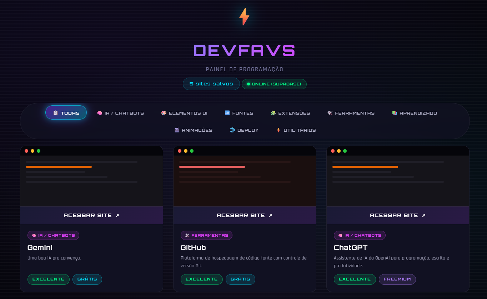

# ⚡ Bellum – Painel de Favoritos para Programadores

**Bellum** é um painel de favoritos moderno, colaborativo e em tempo real.  
Adicione, categorize e compartilhe links de ferramentas, IAs, extensões, fontes e muito mais com toda a comunidade. Tudo salvo na nuvem via **Supabase**, com visual neon cyberpunk. ⚡

🌐 **Acesse agora:** [https://gean-s.github.io/bellum/](https://gean-s.github.io/bellum/)

---

## 📸 Demonstração

*Interface principal com abas de categorias, cards animados e botão flutuante.*

---

## ✨ Funcionalidades

- 📂 **Organização por categorias** – IA, Fontes, Extensões, Ferramentas, Deploy, etc.
- 🌐 **Colaborativo em tempo real** – todos veem e adicionam links instantaneamente.
- 🛡️ **Remoção com confirmação** – modal de segurança evita exclusões acidentais.
- 🎨 **Visual cyberpunk** – efeitos neon, animações, gradientes e scanlines.
- 📱 **Totalmente responsivo** – funciona em desktop, tablet e celular.
- 🔌 **Backend serverless** – usa Supabase (PostgreSQL) como banco de dados.
- 🧠 **Fallback inteligente** – se offline, usa localStorage automaticamente.

---

## 🧱 Tecnologias

| Tecnologia | Uso |
|------------|-----|
| HTML5, CSS3 | Estrutura e estilo |
| JavaScript (Vanilla) | Toda a lógica do front‑end |
| [Supabase](https://supabase.com) | Banco de dados PostgreSQL + API |
| Google Fonts | Tipografia Orbitron e Rajdhani |

---

## 🚀 Como usar localmente

📁 **Código fonte completo:** [Ver index.html](https://github.com/Gean-S/bellum/blob/main/index.html)

---
